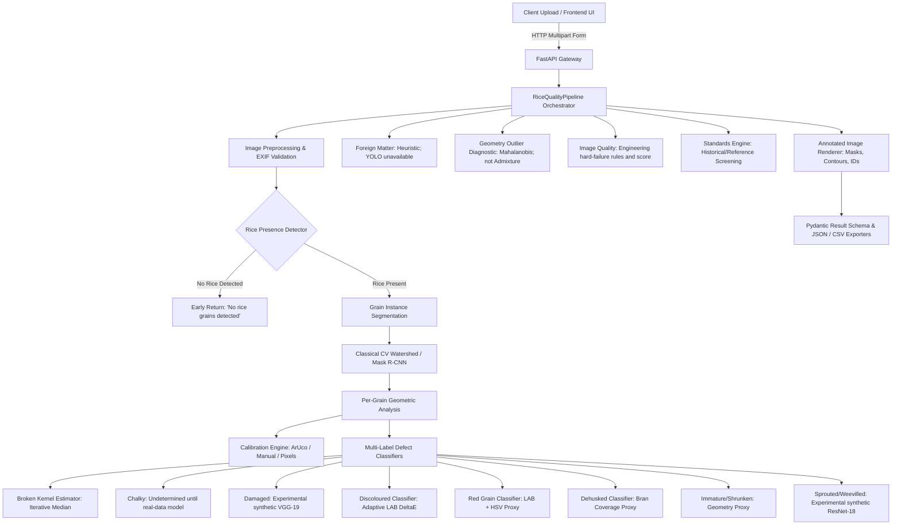

# Rice Quality AI — System Architecture

## 1. High-Level Architecture Overview

The system is designed as a modular, production-ready computer vision and machine learning platform for inspecting raw milled rice grain samples from arbitrary photographs.

## 2. Core Modules and Responsibilities

| Module | Location | Purpose | Key Algorithms / Models |
|---|---|---|---|
| **Pipeline** | `ml/pipeline.py` | Orchestrates the 9-stage analysis flow | End-to-end coordination |
| **Preprocessing** | `ml/preprocessing.py` | Validates format, corrects EXIF orientation, guards against decompression bombs | OpenCV, Pillow |
| **Segmentation** | `ml/segmentation.py` | Segments individual grains, splits touching grains, tags merged instances | Watershed, Distance Transform, Contours, Mask R-CNN |
| **Geometry** | `ml/geometry.py` | Calculates Length, Breadth, L/B ratio, Area, Solidity, Ellipse fitting | cv2.fitEllipse, cv2.minAreaRect, Moments |
| **Calibration** | `ml/calibration.py` | Detects physical reference or uses pixel scale | ArUco dictionary, Homography, Manual factor |
| **Chalkiness** | `ml/texture.py` | Evaluates opaque/chalky kernel areas | Logistic Regression, GLCM Contrast/Energy, LAB Brightness |
| **Damaged** | `ml/classifiers.py` | Experimental normal/damaged prediction; synthetic-only checkpoint | VGG-19 demo checkpoint; not validated on real rice |
| **Sprouted/Weevilled** | `ml/classifiers.py` | Experimental prediction; synthetic-only checkpoint | ResNet-18 demo checkpoint; score uncalibrated |
| **Colour Analysis** | `ml/colour.py` | Red cuticle coverage, Discolouration DeltaE, Dehusked bran coverage | CIELAB Euclidean DeltaE, HSV ranges |
| **Foreign Matter** | `ml/foreign_matter.py` | Full-image heuristic; configured YOLO weights/data unavailable | Color/contour fallback; detector not trained |
| **Admixture** | `ml/admixture.py` | Lower-class admixture unsupported; optional geometry outlier diagnostic only | Mahalanobis distance is not a class/variety label |
| **Standards** | `ml/standards.py` | Screens observed image fractions against historical/reference limits; suppresses small-sample and unreliable-image verdicts | Reference limits; current KMS 2026-27 not verified |
| **Backend API** | `backend/app/` | FastAPI REST endpoints, job management, export streaming | FastAPI, Pydantic v2, Starlette |
| **Frontend UI** | `frontend/` | Interactive dashboard, annotated viewer, grain inspector | React 18, Vite, TypeScript, Tailwind CSS |

## 3. Data Flow & Separation of Concerns

1. **Training vs Inference Separation**:
   - Model training logic lives in `training/` (`train_chalky.py`, `train_damaged.py`, etc.).
   - Inference strictly loads serialized weights and scalers from `models/` without retraining on startup.
   - If model artifacts are missing, labelled fallback components run automatically.

2. **Per-Grain vs Sample-Level Data**:
   - Grains are independently evaluated; each prediction carries model/heuristic provenance.
   - Foreign Matter and Total Count are sample-level. Lower-class Admixture is currently unsupported; geometry outliers are diagnostic only.
